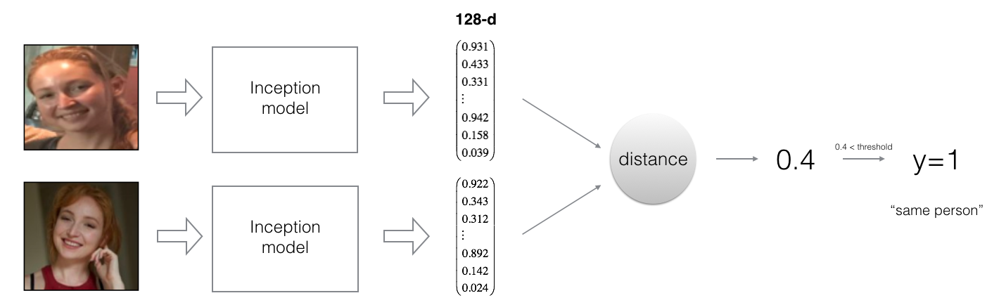

# FaceRecognition

## DATASETS
- Contains Data for Facial Recognition
- Image Data is stored as h5 file

## IMAGES
- Images for Recognition

## WEIGHTS
- Weights for the layers of the model
- All the weights are saved as csv file

Face recognition problems commonly fall into two categories:
Face Verification - "is this the claimed person?". For example, at some airports, you can pass through customs by letting a system scan your passport and then verifying that you (the person carrying the passport) are the correct person. A mobile phone that unlocks using your face is also using face verification. This is a 1:1 matching problem.
Face Recognition - "who is this person?". For example, the video lecture showed a face recognition video of  employees entering the office without needing to otherwise identify themselves. This is a 1:K matching problem.
FaceNet learns a neural network that encodes a face image into a vector of 128 numbers. By comparing two such vectors, you can then determine if two pictures are of the same person.

**Tasks**
- Implement the triplet loss function
- Use a pretrained model to map face images into 128-dimensional encodings
- Use these encodings to perform face verification and face recognition

By using a 128-neuron fully connected layer as its last layer, the model ensures that the output is an encoding vector of size 128. You then use the encodings to compare two face images as follows:

<caption>
 <u>  **Figure 2**:   </u>  By computing the distance between two encodings and thresholding, you can determine if the two pictures represent the same person
</caption>

So, an encoding is a good one if: 
- The encodings of two images of the same person are quite similar to each other. 
- The encodings of two images of different persons are very different.

The triplet loss function formalizes this, and tries to "push" the encodings of two images of the same person (Anchor and Positive) closer together, while "pulling" the encodings of two images of different persons (Anchor, Negative) further apart. 

 
<caption>
 <u>  **Figure 3**:   </u>  In the next part, we will call the pictures from left to right: Anchor (A), Positive (P), Negative (N)  
</caption>
